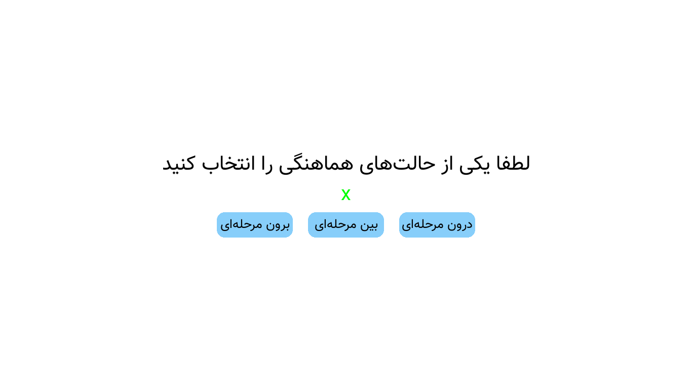

# Multi Stimuli Sync Tasks

**Category:** Cognitive Neuroscience / Experimental Psychology  
**Language:** Python  
**Version:** 1.0  
**Bilingual:** Persian / English  

---

## Project Overview

Multi Stimuli Sync Tasks is a Python-based experimental platform for presenting synchronized **visual and auditory stimuli** in cognitive neuroscience experiments. The software supports configurable **in-phase, inter-phase, and anti-phase coordination patterns**, records precise response times, and exports experiment data for analysis.

The platform is ideal for behavioral studies requiring **precise stimulus timing, repetition control, and response logging**.

---
## Demo


## Features

- **Multisensory Stimulus Presentation**: Supports visual (colored squares) and auditory (NeuroBS tones) stimuli.  
- **Configurable Coordination Modes**: INPHASE, INTER, ANTI phase patterns selectable per trial.  
- **Multithreading**: Separate threads for stimulus display and participant input to ensure precise timing.  
- **Data Logging**: Detailed timestamps for each stimulus display and keypress events, saved as CSV files.  
- **Interactive UI**: Start/Exit buttons, stimulus selection, and instructions in Persian or English.  
- **Customizable Parameters**: Adjustable screen size, stimulus size, delays, durations, repetitions, and font settings via `settings.py`.  
- **Test Mode**: Quickly test the experiment with randomized selections.  

---

## Installation

1. **Install Python 3.10+**  
   Download from [Python Official Website](https://www.python.org/downloads) and ensure you check **Add Python to PATH** during installation.

2. **Install Required Libraries**  
   Navigate to the project folder and run:
   ```bash
   pip install -r requirements.txt
    ```

---

## Usage

### Run Experiment (Main Mode)

```bash
python application.py
```

### Run Experiment with Data Saving

```bash
python application.py -s folder_name
```

### Test Mode (Randomized Trial)

```bash
python application.py -t
```

### Test Mode with Data Saving

```bash
python application.py -t -s folder_name
```

---

## Controls

* **Right Ctrl**: Select INPHASE / VIS
* **Left Ctrl**: Select ANTI / AUD
* **Space**: Select INTER
* **Esc**: Exit experiment or stop stimulus display
* **Mouse Clicks**: Click on-screen buttons to make selections

---

## Settings

All main parameters can be modified in `settings.py`:

* `SCREEN_WIDTH`, `SCREEN_HEIGHT`: Display resolution
* `SQUARE_COLOR`, `BG_COLOR`, `TEXT_COLOR`: Visual customization
* `STIMULI_DELAY`, `STIMULI_DISPLAY_DURATION`, `STIMULI_REPETITION_IN_BLOCK`: Timing and repetitions
* `RIGHT_HAND_SOUND_NAME`, `LEFT_HAND_SOUND_NAME`: Audio stimuli files
* `FONT_PATH`, `FONT_SIZE`: UI text customization

---

## Data Output

Two CSV files per trial:

1. **Data CSV** (`data-<coordination>-<stimulus>.csv`): Records stimulus parameters, durations, repetitions, and response times.
2. **Timestamp CSV** (`timestamp-<coordination>-<stimulus>.csv`): Logs precise timestamps for all events (stimulus display and keypresses).

**Important:** Create a separate folder for each participant to avoid overwriting previous data.

---

## Sound Stimuli Source

* [500 Hz Tone](https://www.neurobs.com/ex_files/expt_view?id=72&tree_item_url=500.wav.lnk&item_id=500.wav.lnk)
* [4000 Hz Tone](https://www.neurobs.com/ex_files/expt_view?id=72&tree_item_url=4000.wav.lnk&item_id=4000.wav.lnk)

---

## Documentation

For a Persian tutorial, refer to:
`./docs/README.pdf`

---

## Technology Stack

* **Python**
* **Pygame**: Visual stimulus rendering
* **pynput**: Keyboard input collection
* **Threading**: Parallel execution of stimuli and responses
* **CSV Logging**: Data storage and export
* **arabic_reshaper & bidi.algorithm**: Persian text support

---

## License

MIT License

---

## References

* NeuroBS Auditory Stimuli: [500 Hz](https://www.neurobs.com/ex_files/expt_view?id=72&tree_item_url=500.wav.lnk&item_id=500.wav.lnk), [4000 Hz](https://www.neurobs.com/ex_files/expt_view?id=72&tree_item_url=4000.wav.lnk&item_id=4000.wav.lnk)
* Python Official Documentation: [https://www.python.org/doc/](https://www.python.org/doc/)


## 👤 Author

**Mohammad Alaei**
AI Researcher & Computer Engineer 
🔗 [https://alaeimo.ir](https://alaeimo.ir) 